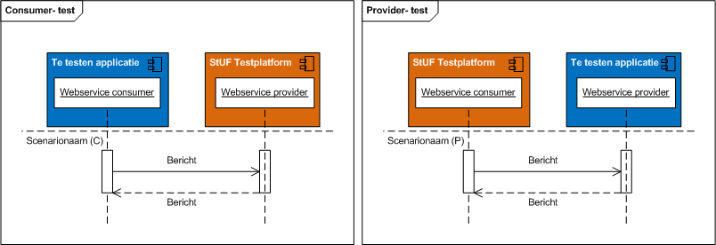

# Compliancy Documentcreatie services
{:.landingpage-header}

|  |  |
| --- | --- |
| **Testsetversie:** | 1.1 |
| **Status** | In gebruik |
| **Datum laatst gewijzigd** | 19 mei 2015 |

## Revisie historie
| Versie | Datum | Reden en aard wijziging |
| --- | --- | --- |
| 1.0 | 01-11-2013 | - |
| 1.1 | 25-11-2014 | Correctief onderhoud; Herindeling en naamswijziging testscenario’s t.b.v. StUF Testplatform release 1.3.0 |
| 1.2 | 19-05-2015 | Publicatie testsetbeschrijving op de gemmaonline. |

## Inleiding
De standaard Documentcreatie services 1.0 is op 2 april 2014 formeel vastgesteld door de StUF Regiegroep. Daarmee heeft de standaard de status ‘In gebruik’ en wordt gemeenten aanbevolen om deze standaard te gebruiken.

Voor een juiste toepassing van de standaard Documentcreatie services worden door KING compliancy instrumenten ontwikkeld met als doel interoperabiliteitsproblemen tussen applicaties bij gemeenten preventief te verminderen. In de paragraaf 2.1 ”Wanneer is een softwareproduct compliant” is aangegeven wanneer een softwareproduct compliant is aan de Documentcreatie services 1.0.

KING adviseert gemeenten bij aanschaf van software die moet voldoen aan deze standaard gebruik te maken van de Handreiking Levering en Acceptatievoorwaarden ICT. Daarin zijn voorwaarden opgenomen over het gebruik van compliancy instrumenten.

Op 1 juni 2014 heeft KING de technische professionals van leveranciers tekst en uitleg gegeven over het deze testset en het gebruik van het StUF Testplatform. Onderliggend document maakt deel uit van de compliancy instrumenten van KING.

## Doel van document
Doel van dit document is het definiëren van een standaard testset voor het testen van koppelingen die gebaseerd zijn op de Documentcreatie services 1.0. Deze testset beschrijft de tests die minimaal voorafgaand aan het in productie nemen van (aangepaste of nieuwe) software door de betreffende softwareleverancier uitgevoerd moeten worden.

De testen dienen uitgevoerd te worden conform deze beschrijving en met behulp en conform de voorwaarden van het StUF Testplatform. Voor gebruik van deze testset is een abonnement nodig op het StUF Testplatform nodig. Organisaties dienen voor zover ze nog geen abonnement hebben zich aan te melden. Zie: [www.stuftestplatform.nl StUF Testplatform]

Indien voldaan wordt aan alle compliancy eisen uit kan de betreffende leverancier aangeven dat het geteste softwareproduct compliant is aan de Documentcreatie services 1.0.

## Wanneer is een softwareproduct compliant
Een softwareproduct is compliant aan de Documentcreatie services 1.0 (*), indien aan alle onderstaande vijf eisen wordt voldaan:

| Nr | Eis |
| --- | --- |
| 1. | Het betreffende softwareproduct getest is conform de eisen en voorwaarden uit onderliggende document inclusief de bijlagen en |
| 2. | De uitvoering heeft plaatsgevonden op en conform de voorwaarden van het StUF testplatform en |
| 3. | Een foutloos testresultaat is behaald en |
| 4. | Finale en authentieke testrapporten openbaar zijn gemaakt op het internet en |
| 5. | In de GEMMA softwarecatalogus heeft u het authentieke testrapport uit stap 4 gepubliceerd bij het betreffende softwareproduct en aangegeven (aangevinkt) dat u compliant bent. |

(*) Hoewel een foutloos testresultaat van deze testset geen absolute zekerheid geeft van 100% interoperabiliteit tussen applicaties, geeft dit wel een goede indicatie van de kwaliteit van de ondersteuning van de standaard.

## Specificatie van testset
Leveranciers van gemeentelijke software dienen koppelingen te leveren die volledig voldoen aan de standaard. Afhankelijk van de GEMMA referentiecomponent(en) die een softwareproduct invult binnen het toepassingsgebied van de standaard, stelt de standaard andere eisen. Daardoor is de testscope niet voor alle applicaties gelijk.

De Documentcreatieservices maken gebruik van de volgende referentiecomonenten:

* Documentcreatieapplicatie (DCA)
* Documentcreatieserviceverzoeker (DCV)

De volgende referentiecomponenten zijn relevant, omdat ze voor of na documentcreatie een rol spelen. Deze referentiecomponenten worden niet vanuit de Documentcreatieservices maar elders gespecificeerd.

* Zaaksysteem (ZS)
* Documentmanagementsysteem (DMS)
* Gegevensmagazijn

Voor een omschrijving van wat het betreffende referentiecomponent inhoudt en welke softwareproducten van welke leveranciers daar invulling aan geven, wordt verwezen naar de GEMMA Softwarecatalogus.

## Consumer en provider testen
Bij elke test is middels een P of C aangegeven of het een Provider of Consumer test betreft. Bij een provider test moet de te testen applicatie een service beschikbaar stellen aan het StUF Testplatform; het StUF Testplatform zal één of meerdere berichten versturen naar de te testen applicatie. In geval van een consumer test levert het StUF Testplatform een service aan de te testen applicatie. De te testen applicatie moet in deze gevallen één of meerdere berichten versturen naar het StUF Testplatform. Afhankelijk of een test een provider of consumer test is verwacht het StUF Testplatform dus een bericht van de te testen applicatie of verstuurt het StUF Testplatform een bericht naar de te testen applicatie.

In de volgende paragrafen wordt per referentiecomponent/rol(*) beschreven welke testen uitgevoerd moeten worden, de testscope. Indien een softwareproduct invulling geeft aan meerdere referentiecomponenten dan is de testscope voor het softwareproduct gelijk aan de gezamenlijke testscope van alle ingevulde referentiecomponenten. Bijvoorbeeld, als een softwareproduct zowel de functionaliteit levert van de referentiecomponent Zaaksysteem als van een Document Management systeem, dan dienen zowel de testen van het referentiecomponent Zaaksysteem als Document Management systeem uitgevoerd te worden.

*Een rol kan gezien worden als een groep van referentiecomponenten die dezelfde generieke functionaliteit bieden. Een voorbeeld hiervan is de Zaakservice consumer. Indien een softwareproduct de rol van Zaakservice consumer invult dan betekent dit dat in dit softwareproduct zaakgerelateerde informatie ontstaat of wordt aangepast en dat deze informatie volgens de services uit de Zaak- en Documentservices wordt ontsloten naar een Zaaksysteem. Vrijwel elk softwareproduct kan de rol van Zaakservice consumer invullen. Denk aan vergunningsystemen, handhavingssystemen, uitkeringensysteem etc.

## Testscope Documentcreatieverzoeker
Indien een softwareproduct invulling geeft aan de referentiecomponent Documentcreatieverzoeker, dan moet op het StUF Testplatform de testset Documentcreatie services uitgevoerd worden voor de rol Documentcreatieverzoeker.

Tijdens de testset uitvoering mogen geen fouten geconstateerd worden door het StUF Testplatform.

Tijdens de testuitvoering simuleert het StUF Testplatform een Documentcreatie Applicatie. Er worden berichten naar het te testen softwareproduct gestuurd waarin zowel verplichte als optionele elementen voorkomen. Tijdens de testuitvoering worden de volgende services getest:

1. Start DocumentcreatieDi02 (C)
2. Ontvang DocumentcreatieResultaatDi01 (P)

De standaard documentcreatie bestaat naast de verplicht te ondersteunen interacties uit een aantal optionele extensies die de basisinteracties uitbreidt. Met behulp van deze extensies kunnen enkele optionele varianten ondersteund worden. Voor drie van deze optionele varianten wordt een testset aangeboden op het StUF Testplatform.

Indien het softwareproduct invulling geeft aan de referentiecomponent Documentcreatieverzoeker, dan kunnen optioneel op het StUF Testplatform de volgende testsets uitgevoerd worden voor de rol Documentcreatieverzoeker:

1. Documentcreatie services 1.1 - Optionele Variant #1 (Opslag door DCA in DMS via Zaak- en Documentservices)
2. Documentcreatie services 1.1 - Optionele Variant #2 (Opslag in DCA in overig DMS)
3. Documentcreatie services 1.1 - Optionele Variant #3 (Gebruikersinteractie tijdens het aanmaken)

Deze optionele testsets zijn een aanvulling op de verplicht uit te voeren compliancy testset voor de Documentcreatieverzoeker en moeten als zodanig dan ook altijd in combinatie met het testrapport voor de testset Documentcreatie services 1.1 in de softwarecatalogus beschikbaar worden gesteld.

De Documentcreatieverzoeker dient te zorgen voor opslag van de gecreëerde documenten. Wanneer dit zaakgerelateerde documenten betreft die opgeslagen worden in een centraal DMS dan dient de DCV dit te doen volgens de standaard ‘Zaak- en Documentservices 1.0’. In dit geval gelden voor de DCV ook de compliancy eisen die voortkomen uit de ‘Zaak- en Documentservices 1.0 testset. De DCV vervult de rol van Documentservice consumer.

## Testscope Documentcreatie Applicatie
Indien een softwareproduct invulling geeft aan de referentiecomponent Documentcreatie Applicatie, dan moet op het StUF Testplatform de testset Documentcreatie services uitgevoerd worden voor de rol Documentcreatie Applicatie.

Tijdens de testset uitvoering mogen geen fouten geconstateerd worden door het StUF Testplatform.

Tijdens de testuitvoering simuleert het StUF Testplatform een Documentcreatieverzoeker. Er worden berichten naar het te testen softwareproduct gestuurd waarin zowel verplichte als optionele elementen voorkomen. Tijdens de testuitvoering worden de volgende services getest:

1. Start DocumentcreatieDi02 (P)
2. Ontvang DocumentcreatieResultaatDi01 (C)

De standaard documentcreatie bestaat naast de verplicht te ondersteunen interacties uit een aantal optionele extensies die de basisinteracties uitbreidt. Met behulp van deze extensies kunnen enkele optionele varianten ondersteund worden. Voor drie van deze optionele varianten wordt een testset aangeboden op het StUF Testplatform.

Indien het softwareproduct invulling geeft aan de referentiecomponent Documentcreatie Applicatie, dan kunnen optioneel op het StUF Testplatform de volgende testsets uitgevoerd worden voor de rol Documentcreatie Applicatie:

1. Documentcreatie services 1.1 - Optionele Variant #1 (Opslag door DCA in DMS via Zaak- en Documentservices)
2. Documentcreatie services 1.1 - Optionele Variant #2 (Opslag in DCA in overig DMS)
3. Documentcreatie services 1.1 - Optionele Variant #3 (Gebruikersinteractie tijdens het aanmaken)

Deze optionele testsets zijn een aanvulling op de verplicht uit te voeren compliancy testset voor de Documentcreatie Applicatie en moeten als zodanig dan ook altijd in combinatie met het testrapport voor de testset Documentcreatie services 1.1 in de softwarecatalogus beschikbaar worden gesteld.

## Bericht varianten
Voor elk testscenario geldt dat de services worden getest met een minimale en maximale variant van een bericht. De maximale variant van een bericht bevat alle door de standaard verplichte en optionele elementen, voorzien van een volgens het RSGB/RGBZ geldige waarde waarbij gerelateerde elementen maximaal twee keer voorkomen en maximaal maximaal twee niveau’s diep (gerelateerde van een gerelateerde)

De minimale variant van een bericht bevat alleen de verplichte elementen, voorzien van een volgens het RSGB/RSGZ geldige waarde waarbij gerelateerde (verplichte) elementen maximaal 1 keer voorkomen.

## Beschrijving testset scenario’s
De testscenario’s behorende bij deze testset zijn beschreven in een spreadsheet.

Per referentiecomponent/rol is een tabblad opgenomen waar u de testscenario’s vindt die relevant zijn voor softwareproducten die deze referentiecomponent/rol invullen. Een testscenario beschrijving bestaat uit een sequence diagram (in UML) en een tabel waarin wordt toegelicht welke acties uitgevoerd moeten worden en wat daarbij het resultaat moet zijn.

 

Afbeelding 2: voorbeeld scenariobeschrijving

Het sequence diagram geeft aan in welke volgorde de berichten verstuurd moeten worden door het StUF Testplatform of de te testen applicatie. De rode bolletjes geven de scenariostappen weer.

Afbeelding 3: voorbeeld sequence diagram

## Gebruik van het StUF Testplatform
Het StUF Testplatform is een onafhankelijk en formeel toetsinginstrument voor het testen van koppelingen gebaseerd op standaarden uit de StUF familie. Het platform is vanaf eind 2011 in productie en wordt beheerd en doorontwikkeld door KING.

Primair is het StUF Testplatform voor ICT softwareleveranciers die werkzaam zijn op de gemeentelijke markt. Zij kunnen vroegtijdig tijdens de ontwikkeling van software testen of applicatie-applicatiekoppelingen voldoen aan StUF. Leveranciers worden geacht een (preventieve) test uit te voeren op het StUF Testplatform voordat een softwareproduct in productie wordt genomen.

In de handleiding StUF Testplatform wordt verder toegelicht hoe het testplatform gebruikt kan worden.
