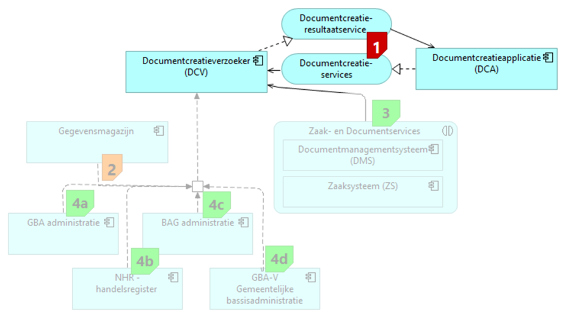

# Techniek Documentcreatie services

De Documentcreatieservices maken gebruik van de volgende referentiecomonenten:

* Documentcreatieapplicatie (DCA)
* Documentcreatieserviceverzoeker (DCV)

De volgende referentiecomponenten zijn relevant, omdat ze voor of na documentcreatie een rol spelen. Deze referentiecomponenten worden niet vanuit de Documentcreatieservices maar elders gespecificeerd.

* Zaaksysteem (ZS)
* Documentmanagementsysteem (DMS)
* Gegevensmagazijn

Voor een omschrijving van wat het betreffende referentiecomponent inhoudt en welke softwareproducten van welke leveranciers daar invulling aan geven, wordt verwezen naar de GEMMA Softwarecatalogus.

